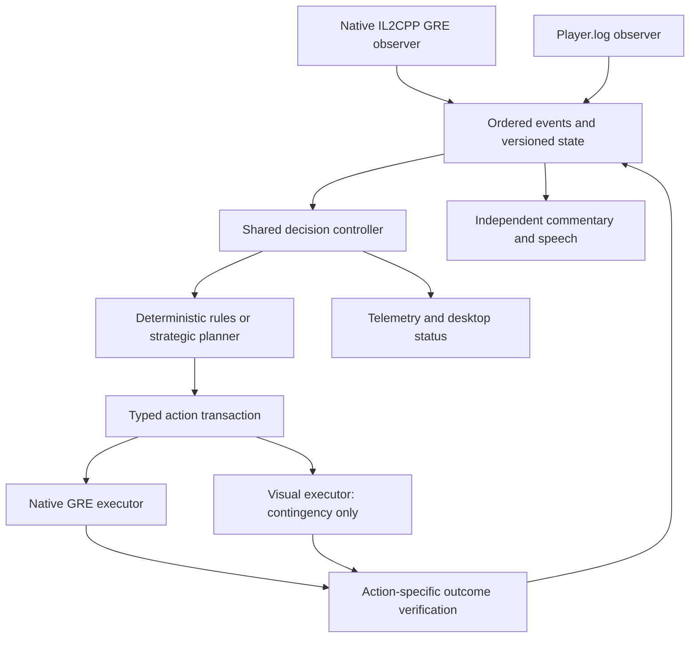

# Autopilot for Native macOS: IL2CPP Port and Reliability Plan

Status: proposed for review.
Date: 2026-09-23.

## 1. Outcome and constraints

Deliver hands-free play of an already-open MTG Arena match on macOS, from play/draw
and mulligan through the final result. Autopilot must play cards, finish their
choices, and recover from transient failures without requiring clicks or toggles.

The implementation order is:

1. Prove direct GRE observation and submission in the native Mac IL2CPP client.
2. Build a reliable shared controller and complete the native bridge's request coverage.
3. Validate latency, recovery, and complete unattended matches.
4. Develop visual execution only if the IL2CPP route fails its documented feasibility gates.

Constraints:

- Use the native `MTGA.app`. No Wine, CrossOver, Proton, or Windows-client workaround.
- Prefer ARM64 execution, but investigate the native app's x86-64 slice under
  Rosetta as a candidate because the currently published BepInEx IL2CPP Mac target
  is x64. Record the selected architecture explicitly; do not assume ARM64 support.
- No vision calls, screen-coordinate clicks, or foreground-window dependency in
  the successful GRE execution path. Verify whether Unity continues processing
  while backgrounded; direct submission alone does not establish that behavior.
- Keep the existing rules, planner, useful decision handlers, and tests. Refactor
  shared orchestration incrementally instead of rewriting working game logic.
- Complete the reliability fixes even if native injection proves infeasible.
- A transient disconnect or an unsupported request is not permission to silently
  switch a functioning GRE session to vision.
- User Stop remains authoritative. Automatic recovery must never re-enable an
  explicitly stopped autopilot.
- Matchmaking, purchases, chat, automatic concessions, and deck editing are outside
  this project. Practice matches used for validation are deliberately initiated.

## 2. Evidence and current baseline

The September 23 match used `NativeMacAutopilot`, not the BepInEx GRE executor.
The session logs record one Keep click and one Space input, with no recorded
successful automated land-play or spell-cast input.

| Finding | Evidence | Required correction |
| --- | --- | --- |
| Arena focus blocked execution | Repeated foreground notices, beginning at 21:43:31 | GRE execution independent of desktop focus; verify background processing |
| Keep was proposed again after submission | Keep clicked at 21:44:32; proposed again at 21:44:43 | Track submitted decisions and confirmed outcomes |
| Uncertain target handling crashed | At 21:44:46, tuple coordinates re-entered a list-only parser | Preserve validated data; test the intended failure path |
| A pause survived later turns | Turn 1 appeared at 21:45:01 without recovery | Scope recoverable failures to the decision that caused them |
| One uncertain response caused another permanent pause | At 21:48:16, optional-action confidence was 0.60 | Bounded fresh observations and recovery on superseding requests |
| Visual execution was expensive | Eight session vision calls took approximately 1.37–4.23 seconds each | Remove vision from routine execution and measure every stage |
| Input delivery was treated as progress | Native `_send()` counts delivered OS input | Separate delivery, acceptance, and verified game effects |
| Decision telemetry was missing | Saved match packet has `decisions: []` | Record the complete transaction lifecycle for every adapter |

Existing workspace fixes address the coordinate crash, bounded uncertainty
retries, stale-response handling, and recovery when a decision changes. The prior
validation run passed 93 focused tests, lint, and formatting checks. Those changes
have not demonstrated a complete successful unattended match. Review and retain
them as regressions while replacing the execution architecture.

Authoritative local evidence:

- `~/.arenamcp/standalone.log`, session starting around 21:41 on 2026-09-23.
- `~/.arenamcp/match_packets/packet_20260923_214928_def7345d-9b48-47e4-8c8c-c6fa57ebdad8.json`.
- The packet begins after the coach restart and has no decision records. Preserve
  the original log interval; the packet is not a complete match execution trace.
- Screenshots captured during investigation are supporting observations, not
  evidence that a proposed input was executed.

### Existing code to reuse

| Area | Current files | Planned treatment |
| --- | --- | --- |
| Strategic planning and land preflight | `src/arenamcp/action_planner.py`, `rules_engine.py` | Retain; consume typed legal options and preserve complete intent |
| Typed decisions and action identity | `src/arenamcp/decisions.py`, `gre_action_matcher.py` | Extend request coverage and identity; remove execution dependence on labels |
| Request lifecycle | `src/arenamcp/request_tracker.py` | Extend to shared, outcome-driven transactions |
| Existing bridge engine | `src/arenamcp/autopilot.py`, `autopilot_bridge.py`, `autopilot_exec.py` | Extract reusable control and verification behavior incrementally |
| Transport and decision polling | `src/arenamcp/gre_bridge.py` | Add negotiated protocol, events, reconnect snapshots, and command deadlines |
| Native visual engine | `src/arenamcp/native_mac_autopilot.py`, `native_mac_input.py` | Preserve regression fixes; later adapt only if contingency is triggered |
| Plugin submission and Unity dispatch | `bepinex-plugin/MtgaCoachBridge/Plugin.Actions.cs`, `Plugin.Pipe.cs`, `MtgaCoachHost.cs` | Reuse behavior where compatible; separate native IL2CPP bindings |
| Runtime integration | `src/arenamcp/standalone.py`, `platform_integration.py`, `desktop/` | Separate action scheduling; expose actual capabilities and health |
| State and diagnostics | `gamestate.py`, `gamestate_decisions.py`, `match_packets.py` | Share normalized state ingestion and capture verified outcomes |

The local `re-output/` sources identify useful interfaces, including
`ActionsAvailableRequest.SubmitAction`, `BaseUserRequest.OnSubmit`, and
`GreInterface.OnMessageReceived`. They are discovery references from another
build, not proof of matching native symbols, layouts, or offsets.

## 3. Architecture

Use one controller with platform-specific observation and execution adapters.

The connected GRE adapter is authoritative for actionable requests. Logs remain
useful for coaching, card enrichment, replay, and diagnostics. Late log messages
must not roll state backward or recreate a request already completed through GRE.

The controller owns planning, deadlines, recovery, and verification. Adapters own
observation and mechanical execution. An adapter must not quietly substitute a
different strategic action.

## 4. Phase 0: preserve evidence and establish regressions

Before changing the runtime:

- Preserve the failing match's log interval and available screenshots in a local
  replay fixture or incident bundle. Redact account/session secrets before adding
  any fixture to the repository.
- Review the existing native fixes and add explicit assertions for failure reason,
  recovery, and absence of unrelated exceptions. An expected pause alone is not
  sufficient to prove correct behavior.
- Reproduce: Keep accepted while mulligan logs linger; low-confidence localization;
  a turn advancing during inference; focus loss; user Stop during recovery; and
  manual actions superseding a planned card play.
- Establish a baseline for delivered inputs versus verified card plays, request
  handling time, model time, timeouts, and manual interventions.
- Identify gaps in match-packet recording before treating old packets as replayable
  action histories. Do not attribute a match win to autopilot when humans played it.

Acceptance: the observed failures have deterministic regressions, and the current
partial fixes are understood without claiming live-match reliability.

## 5. Phase 1: native IL2CPP feasibility investigation

### 5.1 Inventory the exact installed client

Record the game build, Unity version, executable architectures, running process
architecture, metadata location/version, relevant library hashes, and loader/signing
constraints. Check available metadata and exports instead of guessing offsets.

Evaluate a pinned BepInEx 6 IL2CPP build and its matching interop toolchain. The
official artifacts currently include `Unity.IL2CPP-macos-x64`; verify current
availability and compatibility at implementation time. Establish whether ARM64
has a usable supported loader; otherwise test the native x64 app under Rosetta.

Use a reversible test installation/launch configuration. Record exactly which
files and launch settings change so the normal client can be restored. Do not
replace the existing BepInEx 5 Windows plugin with an incompatible binary.

### 5.2 Prove read-only loading and observation

Create a separate IL2CPP plugin project, tentatively
`bepinex-plugin/MtgaCoachBridge.Il2Cpp/`. Keep runtime-specific references out of
the existing `net472` project.

The first plugin should:

- Report its version, actual process architecture, supported protocol, and client
  compatibility fingerprint.
- Obtain a valid Unity-thread dispatcher that survives match/scene transitions.
- Locate the native equivalents of GRE state updates and pending request objects.
- Publish local-seat-visible request IDs, legal actions, card instance IDs, and
  request constraints without issuing gameplay commands.
- Maintain correct IL2CPP wrapper/object lifetimes. Capture immutable DTOs on the
  appropriate thread; do not send raw pointers or live Unity objects to Python.
- Demonstrate observation while Arena is foregrounded and backgrounded. Measure
  throttling and scene-loading behavior rather than assuming focus independence.

The preferred observation boundary is a complete client state/request update after
its constituent GRE messages have been assembled. If observing raw messages, honor
their ordering and pending-message counts before exposing a decision as actionable.

**Gate G1 — observable native client:** repeated launches produce stable,
correctly scoped live requests across scene changes, without gameplay modification.
A loader success message by itself does not pass this gate.

### 5.3 Prove the smallest direct-action path

With the minimal request identity, command expiry, and single-submission protections
from Phase 2 in place, demonstrate in controlled practice scenarios:

1. Choose play/draw and Keep through the pending request.
2. Select a legal Forest Play action by instance identity and submit it.
3. Verify the land transition, then cast a simple creature through its legal action.
4. Handle any required payment/confirmation request and confirm the casting outcome.
5. Pass a pass-only request.
6. Repeat with Arena backgrounded and with the coach reconnecting between actions.

Use the current request's submission API/callback on Unity's thread. Do not replay
captured network packets or fabricate arbitrary game-state changes. Once a request
is submitted, continue its actual successor requests rather than assuming a whole
spell completed in one operation.

**Gate G2 — direct execution:** Keep, a land, and a creature are repeatedly submitted
and verified without screenshots, physical inputs, duplicate submissions, or
manual completion. Record the supported architecture and exact tested client build.

### 5.4 Feasibility decision and contingency trigger

Timebox the initial investigation to approximately 3–5 focused engineering days,
then produce a findings report. This is an investigation budget, not a promise of
compatibility or an automatic abandonment deadline.

- **Go:** the supported configuration passes G1 and G2; proceed with coverage and
  hardening before claiming general autoplay.
- **Continue investigation:** a specific blocker has a testable next hypothesis;
  record it and revise scope with evidence.
- **No-go:** document the loader, interop, request-access, or execution blocker;
  tested architecture/version combinations; failure logs; and remaining uncertainty.
  Only then activate the visual contingency in Phase 8.

An unsupported card family or temporary connection failure after G2 remains a GRE
implementation/recovery issue. It does not automatically trigger visual fallback.

## 6. Phase 2: reliable protocol and shared transactions

Implement the minimal subset alongside G2, then harden it before wider gameplay.

### 6.1 Separate request identity from retry fingerprint

Every actionable observation includes:

- Client/plugin session epoch, match ID, game number, and local seat.
- Exact request identity (`gameStateId`, `msgId`, type, and generation as needed).
- A versioned legal-option set with card instance, action/ability/face identity,
  targets, payment constraints, and stable option tokens within that request.
- Event sequence number, authoritative state revision, and supported capabilities.

Every command includes a unique command ID, the expected session/request/option
version, complete selected options, a deadline, and a cancellation generation.

Keep semantic fingerprints for detecting repeated logical decisions, but do not
use them as execution authorization. Identical options on later turns, another
mulligan, or another match are separate decision episodes.

Labels and `GameAction.__str__()` are display-only. Preserve numeric values, modes,
play/draw choices, target slots, distributions, faces, and identity in structured
payloads end to end. An array index alone is not a durable action identity.

### 6.2 Validate and execute atomically in the plugin

Immediately before calling the client submission API on Unity's thread:

1. Check session, match, local seat, and the current pending request.
2. Reject expired or cancelled commands and stale request/option versions.
3. Resolve the exact selected action against the current legal option set.
4. Check the command ledger to prevent duplicate execution.
5. Submit once and record the local dispatch result.

Preserve deduplication across a transport reconnect in the same plugin session.
A plugin restart creates a new epoch: never replay commands from the old session.
Bound ledger retention without evicting unresolved commands.

For handlers requiring multiple messages, create distinct message objects and wait
for the appropriate successor request/acknowledgment. Do not mutate and resubmit a
shared outbound message that may still be queued for serialization.

### 6.3 Define delivery and outcome states precisely

Track a lifecycle such as:

`PLANNED -> DISPATCHED -> CLIENT_SUBMITTED -> CONFIRMED`

with separate terminal or recovery outcomes:

`REJECTED`, `EXPIRED`, `CANCELLED`, `SUPERSEDED`, `ROLLED_BACK`, and `UNKNOWN`.

- A transport acknowledgment is not a game acknowledgment.
- A successful client method call is not proof that the game accepted the action.
- An arbitrary game-state-ID advance is not proof that the intended card was played.
- If the outcome is uncertain after disconnect, reconcile state before retrying;
  do not promise exactly-once behavior that the system cannot establish.

### 6.4 Fix deadlines and cancellation

Replace the current mismatch between Python's default five-second timeout and the
plugin's 15-second Unity wait with one end-to-end command budget. Validate expiry
again inside the queued Unity callback, not only when the command is received.

Use a negotiated monotonic time basis or a conservatively adjusted remaining TTL;
test transit delay and clock assumptions. Wall-clock timestamps are for audit.

User Stop cancels planning and queued, unexecuted commands. A command already
submitted to the game cannot be recalled merely by cancelling Python; report and
settle that outcome without issuing additional gameplay actions.

**Gate G3 — trustworthy transactions:** stale, duplicate, expired, reordered, and
cancelled commands have deterministic results, including timeout/reconnect races.

## 7. Phase 3: event-driven state and independent control loop

### Transport and state

- Retain loopback IPC initially; TCP and compact JSON are adequate. Optimize
  measured bottlenecks before introducing a binary protocol.
- Add a version/capability handshake bound to the actual game process, not a
  platform-name heuristic. Restrict the endpoint to the intended local session.
- Add ordered request/state events and correlated command responses. Use one
  connection reader/dispatcher, with bounded queues and a defined backpressure
  policy, instead of creating a reader thread for every request.
- Publish immutable data off Unity's thread; never block Unity on socket writes,
  a model response, or telemetry serialization.
- Prioritize control traffic over screenshots, bulk card lookup, or diagnostics.
- Detect sequence gaps and request a full snapshot. On reconnect, restore the
  active match and request before accepting new commands.
- Reuse the existing GameState decoding/reduction where possible. Normalize bridge
  messages and log observations into a common event envelope with provenance and
  deduplication; do not independently apply the same delta twice.
- Define snapshot/delta revision rules and prevent older log observations from
  overwriting newer bridge state. Coaching can continue during bridge loss while
  gameplay waits for an authoritative request.
- Cancel superseded plans promptly when new events arrive. Request/control changes
  invalidate immediately; harmless enrichment should not repeatedly cancel work.

### Shared controller

Extract reusable behavior from the current bridge engine into small components:

| Component | Responsibility |
| --- | --- |
| State store and decision registry | Ordered immutable snapshots, authority, pending request and capabilities |
| Action controller | One active transaction, deadlines, cancellation, recovery and manual intervention |
| Planner | Deterministic choices and bounded strategic inference over typed options |
| Execution adapter | Mechanical submission to the selected supported runtime |
| Outcome verifier | Action-specific evidence and settlement |
| Event recorder | Replayable decisions, attempts, observations and timings |

Autopilot runs independently of commentary, speech, desktop rendering, card-data
warmup, and strategy explanations. These features consume state asynchronously.
Replace unconditional polling sleeps on the action path with event wakeups plus
bounded health/recovery timers.

Do not invoke both the old trigger path and the new controller for the same match.
Keep the existing engine available during migration, with exactly one execution
owner selected per session.

**Gate G4 — responsive control:** fresh requests wake the controller immediately;
slow commentary and UI work cannot delay submission or Stop handling.

## 8. Phase 4: complete request coverage and correct planning

Build a versioned capability matrix. Port existing handlers where compatible;
test each against actual IL2CPP request behavior rather than assuming Mono parity.

| Request family | Required behavior and fixture |
| --- | --- |
| Play/draw and mulligan | Keep, mulligan, repeated mulligan identity, bottom-card selection |
| Land play | Correct instance/face, legal timing, land count, land-trigger follow-ups |
| Spell/ability start | Correct legal action, alternate face/cost, activated ability identity |
| Priority and resolution | Pass only when currently legal and chosen; handle stack responses |
| Targets | All required slots, minimum/maximum counts, player/permanent/stack targets |
| Modes and casting options | Modal choice, alternative/additional costs, optional actions |
| X and numeric input | Legal range/step, selected value retained through payment |
| Mana and payment | Autotap solutions, payment choices, resource changes and cancellation |
| Search and selections | Search, SelectN, grouped selections, gather, select-from-groups |
| Hand/library decisions | Discard, scry, surveil, ordering and selection piles |
| Combat | Attacker identity, attack destinations, blocker assignments and confirmations |
| Damage and distribution | Required allocations, combat ordering where exposed, legal totals |
| Other interactive requests | Replacement effects, counters, trigger ordering, string choices |
| Match transitions | Game end, supported result acknowledgment, reconnect and next-game state |

Unsupported requests produce a typed, visible capability error with a captured
fixture. They do not silently pass, choose an arbitrary option, or stall unseen.
If a result-screen action is unavailable through GRE, investigate the native
client's UI/controller API before considering it proof that the port failed.

Planning changes:

- Preserve deterministic land preflight when enabled and legal. Retain strategic
  exceptions rather than hard-coding that every land must precede every spell.
- Handle pass-only and genuinely forced continuations without a model call.
- Let the model choose among current typed legal options. Reject invented options.
- Keep a strategic turn plan, but revalidate each next action after draws, targets,
  opponent responses, new information, and resource changes.
- Call the planner's execution bookkeeping only after verification; never mark an
  intended card play as completed simply because it was proposed or delivered.
- Budget inference against the current decision deadline. Use an explicit,
  deterministic legal fallback where justified; never blindly pass a turn to make
  the timeout metric look better.
- Preserve uncertainty about the actual game timer. Prefer authoritative timer
  data where available and conservative local budgets otherwise.
- Treat observed manual actions as new authoritative state. Cancel incompatible
  plans and replan; do not fight the user's input or count it as bot success.

**Gate G5 — functional coverage:** every enabled request family has protocol,
executor, verification, and scenario coverage. Publish the remaining limitations.

## 9. Phase 5: verification and recovery

Action-specific confirmation must distinguish intermediate progress from success:

- **Land:** the selected hand/command-zone action causes the appropriate battlefield
  transition and land-use update. Account for zone-change instance-ID remapping.
- **Spell:** the chosen object enters casting/stack processing or produces its
  expected follow-up request. Resolve all required choices before declaring the
  casting transaction complete. A spell being countered later is not an input failure.
- **Selection/payment:** the selected options are acknowledged by the corresponding
  updated request or state transition, with all required slots satisfied.
- **Priority:** the specific request is consumed or superseded by the expected
  priority/phase transition, not merely by unrelated background state traffic.

Recovery policy:

| Condition | Response |
| --- | --- |
| Request superseded during planning | Cancel old plan and process the new request |
| Transport disconnected | Reconnect, obtain snapshot, reconcile command outcome |
| Command response lost | Query/reconcile the same command ID; do not issue a fresh duplicate |
| Submission rejected | Refresh the authoritative request and replan within its budget |
| No confirmed progress | Capture evidence, classify outcome, use bounded recovery |
| Decision-specific ambiguity | Retry current observation; allow a genuinely new decision to recover |
| Unknown capability or invalid state | Show an actionable blocked status and retain diagnostics |
| User Stop | Cancel unsent work and remain stopped across state changes/reconnects |

Keep retry budgets per decision episode. Neither cosmetic state churn nor a new
transport connection resets an exhausted budget. A later independent turn/request
must not inherit a permanent pause from an earlier decision.

## 10. Phase 6: performance, telemetry, and honest status

Instrument monotonic timestamps for observation, state publication, planning start
and finish, queueing, Unity dispatch, client submission, and outcome confirmation.
Correlate all records by session, match, request, transaction, and command IDs.

Record every adapter's structured proposal, attempts, selected options, source
revision, outcome evidence, recovery, manual interventions, and model timing in
match packets. A coach restart must append a new session segment instead of losing
the earlier portion of the same match. Keep diagnostics bounded and apply the
project's existing local-storage/reporting conventions.

### Initial latency targets

These are acceptance targets to benchmark, not existing measured capabilities.
Use warm runtime measurements and report cold startup separately.

| Metric | Initial target |
| --- | --- |
| Actionable native request -> Python decision event | p95 <= 100 ms |
| Forced action or already-selected land: request -> local client submission | p95 <= 250 ms |
| Routine GRE execution | Zero vision calls and zero physical input events |
| Nontrivial strategy: observation -> submission | Target p95 <= 3 seconds on the selected backend; deadline-aware fallback if missed |
| Superseding request -> old plan invalidated | p95 <= 100 ms |
| Stop -> controller/queue cancellation observed | p95 <= 100 ms; already-submitted effects reported separately |
| Duplicate, expired, wrong-request commands executed | Zero |
| Recorded transaction outcomes | 100% accounted for, including UNKNOWN |

Measure p50/p95/p99 and sample counts. Separate provider latency, application
latency, server response, and game animation time. Do not exclude failed or stalled
decisions from latency reports. Test backgrounded Arena as its own configuration.

Desktop status must distinguish Off, Preparing, Ready, Planning, Submitted,
Waiting for Game, Reconnecting, Recovering, and Blocked. Display the pending action,
last confirmed action, execution backend, and reason for any wait. A connected
socket or enabled toggle alone must not be labeled working autoplay.

Warm necessary models/card data outside the active-turn path. Keep explanations
and speech asynchronous, with no action waiting for narration.

## 11. Phase 7: validation and release gates

### Layered validation

1. **Unit/regression tests:** today's failures, structured-intent preservation,
   semantic fingerprints versus exact request identities, action-specific outcomes,
   manual takeover, and explicit Stop.
2. **Protocol simulations:** delayed/lost/duplicated/reordered messages, reconnects,
   stale snapshots, sequence gaps, same-index/different-card requests, and plugin
   session changes. Include a command executing near its expiry/Stop boundary.
3. **Native adapter integration:** actual loader, interop bindings, Unity-thread
   enforcement, wrapper lifetime, transitions, background operation, and capability
   negotiation on the pinned client build.
4. **Recorded replay:** state/request traces, planner results, and failure injection
   with a virtual clock. Logs alone cannot reproduce UI-only state; visual scenarios
   require captured frames if the contingency is activated.
5. **Controlled practice scenarios:** each supported family, duplicate-name cards,
   modal/alternate-face cards, X costs, multiple target slots, combat, search,
   reconnects, and user intervention.
6. **Complete-match trials:** representative decks and transitions, with input and
   confirmation telemetry proving the actions were performed by autopilot.

Reuse and extend the existing native, request-tracker, typed-decision, bridge-timeout,
and match-packet test suites. Add native plugin test coverage where the new port
introduces behavior. Preserve Windows bridge regressions while sharing the core.

### Release criteria

- G1–G5 pass on the documented native-client configuration.
- At least five cold launches and ten scene transitions without observer/executor loss.
- At least 10,000 simulated protocol/fault cases with no duplicate, expired, or
  wrong-request execution.
- Every enabled interactive family passes an explicit scenario; easy matches alone
  do not establish complete coverage.
- At least 20 consecutive full practice matches across three representative decks
  with no required manual intervention and no timeout caused by autopilot.
- Latency targets are measured with sample counts; misses have a documented fix or
  an explicit revised release decision, not an omitted data point.
- All actions and failures appear in replayable telemetry; there are no silent pauses.
- User Stop, manual intervention, reconnect, restart, and background behavior pass.

These sample sizes are release gates, not proof that every future card interaction
will work. State the tested coverage and unsupported capabilities in the UI/docs.

Do not use another live competitive match as the first integration test.

## 12. Phase 8: visual contingency, only after documented IL2CPP no-go

If the native GRE feasibility work cannot produce a supported implementation:

- Keep the shared controller, typed transactions, state authority rules, deadlines,
  verification, telemetry, and acceptance tests from the earlier phases.
- Replace the standalone visual engine with an execution adapter; do not retain a
  second independent recovery state machine.
- Use persistent ScreenCaptureKit capture rather than spawning `screencapture`
  repeatedly. Benchmark capture, scaling, and encoding costs separately.
- Add local recognition/grounding for routine buttons and known stable interactions.
  Prefer current legal card identity; never assume all same-name cards are equivalent.
- Use remote vision only when local grounding cannot resolve a supported action.
  Avoid two serial model calls when one validated grounding operation suffices.
- Preserve full structured intent, inspect hover-induced layout changes, and
  verify completed card actions rather than counting clicks.
- Make foreground/focus and permission requirements explicit. Do not bypass target
  ownership checks or send blind background clicks.
- Reuse bounded retries and state-driven recovery from the shared controller.

This fallback must pass its own latency and unattended-match gates. If it cannot
meet them, report the limitation rather than presenting assisted clicks as reliable
hands-free autopilot.

For this route, replace the IL2CPP-specific G1/G2 checks with equivalent visual
observation/execution gates. G3–G5, complete request coverage, Stop behavior,
telemetry, and unattended-match qualification still apply. Native-loader failure
does not waive any shared reliability requirement.

## 13. Phase 9: packaging, migration, and compatibility maintenance

- Pin and record loader/interop/plugin versions and the tested client fingerprint.
- Add native installation, launch, repair, and clean removal support after G2.
- Validate the running process and negotiate capabilities before enabling execution;
  replace the current assumption that native macOS can never have a GRE bridge.
- Detect incompatible game updates. Run read-only compatibility probes before
  enabling submission; never execute against guessed offsets or stale bindings.
- Add a Mac build/validation workflow for the plugin and controller. Keep game
  assemblies/metadata local or in an appropriate private build environment.
- Migrate Windows execution to the shared contract in controlled increments; do not
  break existing deployment while developing the native adapter.
- Document native architecture, installation, supported requests, diagnostics, and
  tested background behavior. Update `docs/PLATFORM_PARITY.md` and the plugin README,
  including obsolete named-pipe descriptions where the code now uses TCP.
- A code update is not live validation. Restart the coach deliberately and confirm
  the loaded plugin/controller versions before running acceptance scenarios.

## 14. Work packages and sequencing

| Package | Deliverable | Dependency / review point |
| --- | --- | --- |
| P0 | Incident fixtures and reviewed regression fixes | First; preserve existing workspace edits |
| P1 | Native inventory and pinned loader/interop experiment | G1 report; initial 3–5-day investigation budget |
| P2 | Minimal native Keep/Forest/creature proof with command guards | G2; determines port feasibility |
| P3 | Versioned protocol, identities, deadlines, deduplication | Minimal subset with P2; full G3 before expanded play |
| P4 | Event-driven state and shared action controller | P3 plus the successful P2 adapter, or the explicit P8 contingency; G4 |
| P5 | Full request adapters, structured planning, verification/recovery | P4; coverage matrix and G5 |
| P6 | Complete telemetry, status, and performance work | Start tracing in P0/P2; finish against P4/P5 |
| P7 | Fault/replay suites and unattended practice qualification | P3–P6; release evidence |
| P8 | Visual adapter contingency | Only after documented IL2CPP no-go; retain P3–P7 requirements |
| P9 | Native packaging, repair, compatibility probes, and migration | After feasibility; complete before general release |

P0 and protocol design can proceed alongside the native feasibility investigation.
Do not spend the main implementation budget optimizing vision or polishing a new
controller before native request access and direct submission have been proven.
The cross-cutting reliability work remains required whichever adapter succeeds.

Estimate the full implementation after G2 exposes the actual interop and request
coverage costs. Keep findings, benchmarks, fixtures, and unresolved risks attached
to each gate so scope changes are reviewable.

## 15. Definition of done

The native client can complete supported matches without clicks, routine actions
execute through GRE with measured low latency, transient failures recover without
toggles, and every submitted action has an auditable outcome. Unsupported behavior
is explicit. A new game build either passes compatibility checks or stops execution
with a clear diagnosis. User Stop always retains control.

The first reviewable implementation milestone is intentionally small: a native
IL2CPP plugin that observes the correct live request, submits Keep and a Forest by
identity, and proves both outcomes. The completed product requires all subsequent
coverage, reliability, performance, and release gates.

## References

Verified during the September 23 investigation; recheck at implementation time:

- [BepInEx IL2CPP installation guide](https://docs.bepinex.dev/master/articles/user_guide/installation/unity_il2cpp.html): native macOS x64 target and loader setup.
- [Official BepInEx bleeding-edge artifacts](https://builds.bepinex.dev/projects/bepinex_be): published runtime/architecture combinations; artifact availability does not prove Arena compatibility.
- [Apple ScreenCaptureKit overview](https://developer.apple.com/videos/play/wwdc2022/10155/): streamed capture for the conditional visual implementation.
